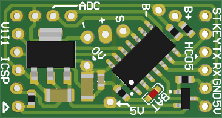
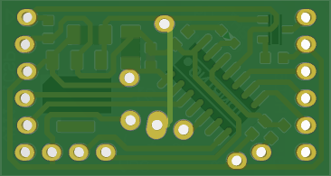

# ChicoServo - HW #

This is a fully working board which you may wanna use as reference or may clone and customize to your needs. The board was designed to an specific project which required ADC, PWM, SERIAL, and I/O connection.

Example firmware [**here**](https://bitbucket.org/jpnbino/fw_palhaservo/src/master/).

## PCB ##

### Board details ###

|  Item           |Description |
|-----------------|------------|
| Core            | PIC16LF1824|
| Input Voltage (Vin)   |  4.75V ≤ Vin ≤ 10V    |
| Board Size      | 16.5mm x 31mm|
| User LED        | 1            |

### The project ###

* Quick summary

  * Contains source files from IDE Altium Designer which can be used rebuild this project or adopted as an user may need.

* Version

  * V1I1 - Initial.

### Video ####

I recorded this video when I was building the first prototype.

